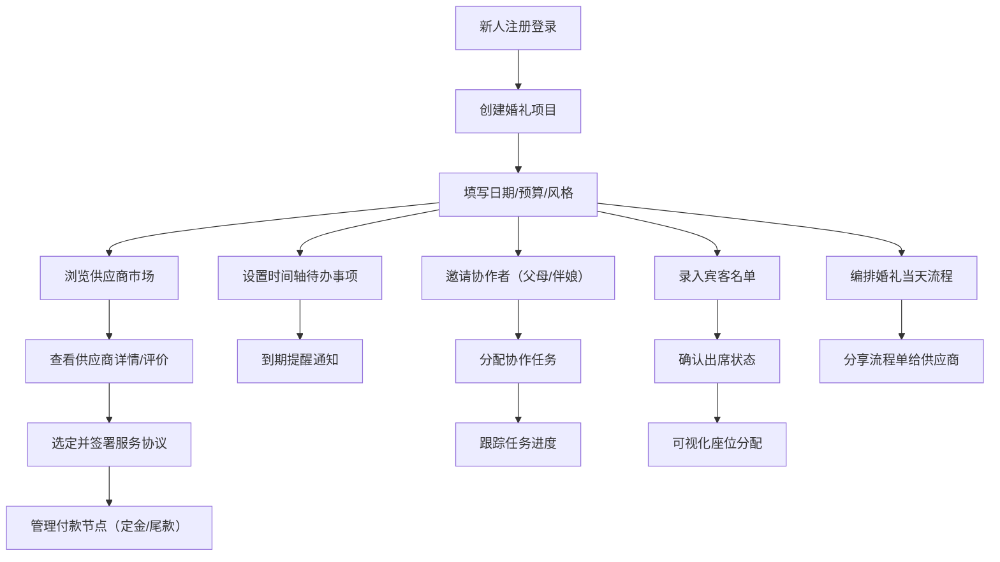

## 1. 产品概述

婚礼筹备与供应商协作平台，一站式解决新人婚礼全流程管理难题，连接新人与优质供应商，实现协作分工、时间管理和资源统筹。

- 目标用户：准新人、双方父母、伴娘伴郎、婚礼供应商
- 核心价值：简化筹备流程，明确任务分工，透明化供应商管理，确保婚礼细节零遗漏

## 2. 核心功能

### 2.1 用户角色

| 角色 | 注册方式 | 核心权限 |
|------|----------|----------|
| 新人（主用户） | 手机号/邮箱注册 | 创建婚礼项目、管理全部模块、分配协作任务、签约付款 |
| 协作者（父母/伴娘） | 邀请链接注册 | 查看分配任务、更新任务进度、查看相关信息 |
| 供应商 | 独立注册/平台入驻 | 管理作品集、接收订单、查看婚礼流程、确认收款 |
| 平台管理员 | 后台登录 | 供应商审核、平台运营 |

### 2.2 功能模块

1. **婚礼项目总览**：项目卡片、日期倒计时、预算概览、快速入口
2. **供应商市场**：分类浏览、作品集展示、真实评价、筛选搜索
3. **服务协议与付款**：电子协议签署、付款节点管理、支付记录
4. **项目时间轴**：待办事项、到期提醒、进度可视化
5. **协作中心**：成员管理、任务分配、进度跟踪
6. **宾客管理**：宾客名单、出席确认、座位表可视化编辑
7. **婚礼流程单**：流程编排、供应商视角分享、实时更新

### 2.3 页面详情

| 页面名称 | 模块名称 | 功能描述 |
|----------|----------|----------|
| 登录注册页 | 表单区域 | 账号注册/登录、角色选择、邀请码输入 |
| 项目总览页 | 项目卡片墙 | 显示婚礼日期倒计时、预算使用情况、关键节点提醒 |
| 项目总览页 | 快捷入口 | 供应商市场、待办事项、宾客管理、流程单入口 |
| 供应商市场页 | 分类导航 | 摄影、场地、花艺、主持、乐队、化妆、婚纱、喜糖等品类 |
| 供应商市场页 | 供应商卡片 | 头像、名称、评分、价格区间、作品集缩略图 |
| 供应商详情页 | 作品集展示 | 图片轮播、案例描述、服务套餐 |
| 供应商详情页 | 用户评价 | 真实评价列表、评分统计、图片反馈 |
| 供应商详情页 | 签约入口 | 选择服务套餐、签署协议、支付定金 |
| 协议与付款页 | 协议列表 | 已签约供应商、协议状态、电子签名 |
| 协议与付款页 | 付款节点 | 定金/尾款/中期款金额、截止日期、支付状态 |
| 时间轴页 | 时间轴视图 | 婚礼前按月/按周展示待办事项、完成状态 |
| 时间轴页 | 提醒设置 | 到期前提醒天数、推送通知方式 |
| 协作中心页 | 成员管理 | 协作者列表、角色标签、邀请新成员 |
| 协作中心页 | 任务分配 | 创建任务、指定负责人、截止日期、进度更新 |
| 宾客管理页 | 宾客列表 | 姓名、关系、联系方式、出席状态、随行人数 |
| 宾客管理页 | 座位编辑器 | 拖拽式桌位分配、桌子样式选择、宾客拖动入座 |
| 婚礼流程单页 | 流程时间线 | 按时间排序的环节列表、负责人、地点、备注 |
| 婚礼流程单页 | 供应商视角 | 按供应商筛选仅显示与其相关的时间节点 |

## 3. 核心流程

新人注册登录后创建婚礼项目，填写基础信息（日期、预算、风格），随后浏览供应商市场，选定心仪供应商后签约付款。在筹备过程中，通过时间轴跟踪待办事项，邀请家人朋友协作分工，管理宾客名单与座位安排。婚礼前生成详细流程单，各供应商可查看各自负责的时间节点。

## 4. 用户界面设计

### 4.1 设计风格

- **主色调**：玫瑰金 #D4A574（温暖优雅），搭配奶油白 #FFF8F0
- **辅助色**：柔粉 #F5D5D4，深棕 #3D2914，翠绿 #7BA17C（花艺点缀）
- **按钮风格**：圆角矩形（8px），轻微阴影，悬停时上浮2px
- **字体**：标题使用 Cormorant Garamond（衬线体，优雅婚礼感），正文使用 Noto Sans SC（中文清晰易读）
- **布局风格**：卡片式布局，大量留白，柔和渐变背景，细线分隔
- **图标风格**：线性图标，圆角端点，1.5px线条，婚礼主题元素（花环、戒指、香槟杯）

### 4.2 页面设计概览

| 页面名称 | 模块名称 | UI元素 |
|----------|----------|--------|
| 登录注册页 | 表单区域 | 大理石纹理背景、金色装饰边框、衬线体标题、柔和输入框 |
| 项目总览页 | 倒计时区域 | 大号数字显示、动态翻页效果、婚礼主题装饰线 |
| 项目总览页 | 预算概览 | 环形进度图、分类支出标签、悬停显示明细 |
| 供应商市场页 | 分类导航 | 横向滑动标签、品类图标、选中态底部金色彩带 |
| 供应商市场页 | 卡片网格 | 瀑布流布局、悬停放大作品缩略图、评分星星动画 |
| 供应商详情页 | 作品集 | 大图轮播、平滑过渡、点击放大灯箱效果 |
| 时间轴页 | 时间轴 | 左侧金线时间标记、右侧卡片内容、已完成状态打勾动画 |
| 座位编辑器 | 画布区域 | 网格背景、圆形桌子图标、拖拽宾客头像入座、连线显示关系 |
| 婚礼流程单页 | 时间线 | 垂直时间轴、供应商色块标签、点击展开详情 |

### 4.3 响应式

- 桌面端优先设计（1440px宽度基准）
- 平板端（768-1024px）：卡片两列布局，侧边栏折叠为抽屉
- 移动端（<768px）：单列布局，底部Tab导航，简化操作步骤

## 5. 数据模型（补充）

主要数据实体：
- WeddingProject（婚礼项目）：日期、预算范围、风格偏好、地点
- Vendor（供应商）：品类、作品集、评分、服务套餐、联系方式
- ServiceContract（服务协议）：关联项目与供应商、服务内容、价格、签署状态
- Payment（付款记录）：关联协议、节点类型、金额、截止日、支付状态
- TodoItem（待办事项）：关联项目、标题、日期、提醒设置、完成状态、负责人
- Collaborator（协作者）：关联项目、用户信息、角色标签
- Guest（宾客）：关联项目、姓名、关系、联系方式、出席状态、随行人数、桌号
- SeatTable（桌位）：关联项目、桌号、名称、容量、宾客列表
- WeddingTimeline（婚礼流程）：关联项目、时间点、环节名称、地点、负责人、备注
