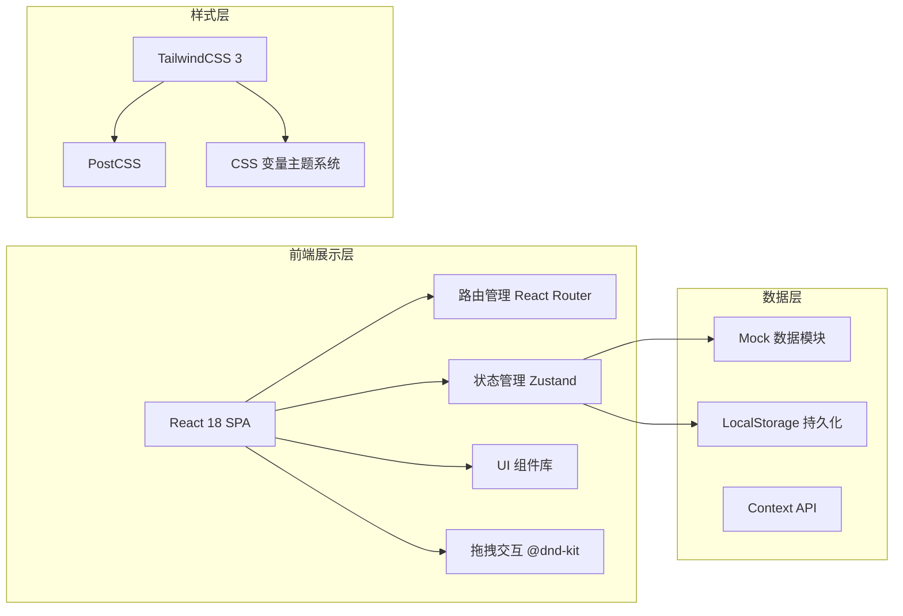
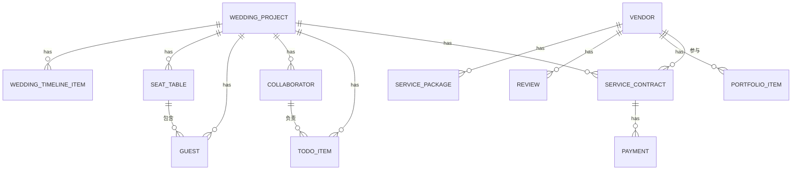

## 1. 架构设计



## 2. 技术说明

- **前端框架**：React@18 + TypeScript@5 + Vite@5
- **构建工具**：Vite（快速HMR，优化构建）
- **样式方案**：TailwindCSS@3 + PostCSS + CSS变量主题系统
- **路由管理**：React Router Dom@6
- **状态管理**：Zustand（轻量级、简洁API）
- **UI组件**：自定义组件 + Lucide React（图标）
- **拖拽功能**：@dnd-kit（座位编辑器、任务排序）
- **图表展示**：recharts（预算饼图、进度条）
- **日期处理**：dayjs（倒计时、日期计算）
- **数据存储**：Mock数据 + LocalStorage持久化（无后端）

## 3. 路由定义

| 路由路径 | 页面用途 |
|----------|----------|
| `/login` | 登录注册页面 |
| `/` | 婚礼项目总览（Dashboard） |
| `/vendors` | 供应商市场列表 |
| `/vendors/:id` | 供应商详情页 |
| `/contracts` | 服务协议与付款管理 |
| `/timeline` | 项目时间轴与待办事项 |
| `/collaboration` | 协作中心（成员+任务） |
| `/guests` | 宾客名单管理 |
| `/seating` | 可视化座位编辑器 |
| `/wedding-day` | 婚礼当天流程单 |

## 4. 数据模型定义

### 4.1 TypeScript 类型定义

```typescript
// 婚礼项目
interface WeddingProject {
  id: string;
  coupleName: string;
  groomName: string;
  brideName: string;
  weddingDate: string;
  location: string;
  budget: {
    total: number;
    used: number;
  };
  style: 'romantic' | 'modern' | 'vintage' | 'chinese' | 'outdoor';
  styleNote?: string;
  createdAt: string;
}

// 供应商
interface Vendor {
  id: string;
  name: string;
  category: VendorCategory;
  avatar: string;
  coverImages: string[];
  rating: number;
  reviewCount: number;
  priceRange: { min: number; max: number };
  description: string;
  portfolio: PortfolioItem[];
  reviews: Review[];
  packages: ServicePackage[];
  contact: { phone: string; wechat?: string };
}

type VendorCategory = 
  | 'photography' 
  | 'venue' 
  | 'florist' 
  | 'host' 
  | 'band' 
  | 'makeup' 
  | 'dress' 
  | 'candy';

interface PortfolioItem {
  id: string;
  title: string;
  images: string[];
  description: string;
  date: string;
}

interface Review {
  id: string;
  userName: string;
  avatar: string;
  rating: number;
  content: string;
  images?: string[];
  date: string;
}

interface ServicePackage {
  id: string;
  name: string;
  price: number;
  features: string[];
}

// 服务协议
interface ServiceContract {
  id: string;
  projectId: string;
  vendorId: string;
  vendorName: string;
  packageId: string;
  packageName: string;
  totalPrice: number;
  status: 'draft' | 'pending' | 'signed' | 'completed' | 'cancelled';
  signedAt?: string;
  payments: Payment[];
  serviceDate: string;
  notes?: string;
}

interface Payment {
  id: string;
  type: 'deposit' | 'midterm' | 'final';
  amount: number;
  dueDate: string;
  paidAt?: string;
  status: 'pending' | 'paid' | 'overdue';
}

// 待办事项
interface TodoItem {
  id: string;
  projectId: string;
  title: string;
  description?: string;
  dueDate: string;
  category: 'document' | 'vendor' | 'preparation' | 'guest' | 'dayof';
  priority: 'high' | 'medium' | 'low';
  completed: boolean;
  completedAt?: string;
  assigneeId?: string;
  reminderDays: number;
  reminded: boolean;
}

// 协作者
interface Collaborator {
  id: string;
  projectId: string;
  name: string;
  avatar: string;
  role: 'groom_family' | 'bride_family' | 'bridesmaid' | 'groomsman' | 'friend';
  roleLabel: string;
  phone: string;
  tasksAssigned: number;
  tasksCompleted: number;
}

// 宾客
interface Guest {
  id: string;
  projectId: string;
  name: string;
  relation: 'groom' | 'bride' | 'both';
  relationLabel: string;
  phone: string;
  rsvpStatus: 'pending' | 'confirmed' | 'declined';
  plusOnes: number;
  tableId?: string;
  seatNumber?: number;
  dietaryNote?: string;
  gift?: string;
}

// 桌位
interface SeatTable {
  id: string;
  projectId: string;
  tableNumber: number;
  name?: string;
  capacity: number;
  shape: 'round' | 'rectangle';
  position: { x: number; y: number };
  guestIds: string[];
}

// 婚礼流程
interface WeddingTimelineItem {
  id: string;
  projectId: string;
  time: string;
  title: string;
  location: string;
  description?: string;
  responsibleIds: string[]; // 协作者ID或供应商ID
  responsibleType: 'collaborator' | 'vendor' | 'both';
  vendorIds?: string[];
}

// 当前用户
interface CurrentUser {
  id: string;
  name: string;
  avatar: string;
  role: 'couple' | 'collaborator' | 'vendor';
  projectId: string;
}
```

### 4.2 ER 图



## 5. 项目目录结构

```
src/
├── assets/              # 静态资源（图片、字体）
├── components/          # 通用组件
│   ├── layout/         # 布局组件（Sidebar, Header, Layout）
│   ├── ui/             # 基础UI组件（Button, Card, Modal, Input等）
│   └── shared/         # 业务共享组件
├── data/                # Mock数据
│   ├── vendors.ts
│   ├── projects.ts
│   ├── guests.ts
│   └── ...
├── pages/               # 页面组件
│   ├── Login.tsx
│   ├── Dashboard.tsx
│   ├── Vendors.tsx
│   ├── VendorDetail.tsx
│   ├── Contracts.tsx
│   ├── Timeline.tsx
│   ├── Collaboration.tsx
│   ├── Guests.tsx
│   ├── Seating.tsx
│   └── WeddingDay.tsx
├── store/               # Zustand状态管理
│   ├── useProjectStore.ts
│   ├── useVendorStore.ts
│   ├── useGuestStore.ts
│   └── useAuthStore.ts
├── types/               # TypeScript类型定义
│   └── index.ts
├── utils/               # 工具函数
│   ├── date.ts
│   ├── format.ts
│   └── storage.ts
├── App.tsx
├── main.tsx
└── index.css
```

## 6. 设计规范补充

### CSS 变量主题

```css
:root {
  --color-rose-gold: #D4A574;
  --color-rose-gold-light: #E8C9A0;
  --color-rose-gold-dark: #B88B5C;
  --color-cream: #FFF8F0;
  --color-soft-pink: #F5D5D4;
  --color-dark-brown: #3D2914;
  --color-sage-green: #7BA17C;
  --color-bg: #FFFBF7;
  --color-card: #FFFFFF;
  --color-border: #F0E6D8;
  --color-text-primary: #3D2914;
  --color-text-secondary: #8B7355;
  --color-text-muted: #B8A88A;
  --font-display: 'Cormorant Garamond', serif;
  --font-body: 'Noto Sans SC', sans-serif;
  --shadow-soft: 0 2px 12px rgba(212, 165, 116, 0.08);
  --shadow-medium: 0 4px 24px rgba(212, 165, 116, 0.12);
  --shadow-lift: 0 8px 32px rgba(212, 165, 116, 0.16);
  --radius-sm: 4px;
  --radius-md: 8px;
  --radius-lg: 16px;
  --radius-xl: 24px;
}
```
